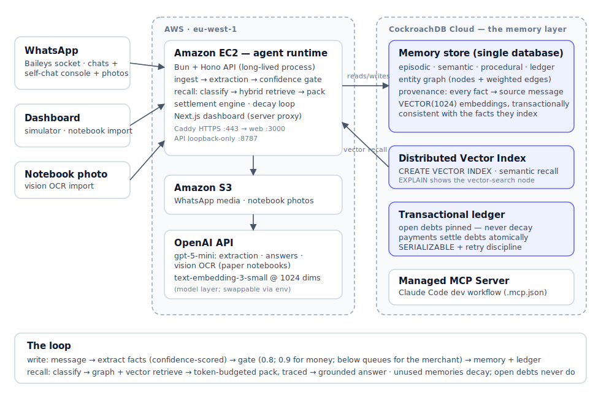

# Kata — the notebook that never forgets

**A memory engine with domain-aware forgetting and confidence-gated writes,
built for businesses that run entirely on WhatsApp — with CockroachDB as the
single memory layer.**

🔗 **Live demo:** https://34.247.107.117.sslip.io — sign in with the demo
password `kata-crdb-2026` ·
🪳 Built for the [CockroachDB × AWS Hackathon — Build with Agentic Memory](https://cockroachdb-ai.devpost.com/)

Millions of merchants run their whole operation — orders, customers, informal
credit ("book me down, I'll pay Friday"), supplier quotes — inside WhatsApp
chats and paper notebooks. Everything is forgotten: who owes what, who always
buys what, what the supplier quoted last month. Money is lost to forgotten
memory.

Kata sits in the merchant's WhatsApp, accumulates structured memory from the
chat stream (and from photographed notebook pages), and answers instantly
across sessions: *"who owes me money?"*, *"what did Mama Chidinma order last
time?"*, *"what is the rice supplier's current price?"*

## Why not just RAG? (the memory thesis)

Generic memory frameworks treat all facts alike and apply uniform decay. A
merchant's memory has **domain semantics**:

- Preferences drift and fade.
- Resolved transactions archive.
- Contradictions supersede, with history retained.
- **Open debts never decay.** In this memory system, forgetting a debt is a
  bug, not a feature.

And because a wrong debt amount is worse than no memory at all, writes are
**confidence-gated**: low-confidence extractions queue for one-tap merchant
confirmation before they touch the ledger, and every fact carries provenance
back to its source message.

Money questions are never answered from text similarity. Debts and payments
live in a **transactional ledger** inside the same CockroachDB database as the
embeddings — payments settle debts atomically, and "who owes me money?" reads
computed balances, not retrieved paragraphs.

## Benchmark: exact recall against real baselines

Deterministic synthetic merchant history (228 messages, 24 customers, exact
tracked balances, superseding supplier quotes, noise), scored by regex against
**generated ground truth — no LLM grades an LLM**. All four systems use the
same model and the same 800-token context budget:

| system | exact recall | phantoms* | avg context tokens |
|---|---|---|---|
| **Kata** | **100%** | **0** | **464** |
| naive RAG (embed raw messages) | 87% | 0 | 787 |
| recent window | 0% | 0 | 792 |
| full history (no budget) | 82% | 8 | 4,148 |

*phantoms = fabricated or stale claims, e.g. listing a paid-up customer as a
debtor. Full-context pays 9× the tokens and still hallucinates balances,
because it re-derives arithmetic from raw chat every time. Kata answers from
settled ledger state.

Reproduce: `cd apps/api && bun run bench` (results land in
`benchmark-results.json`).

## Architecture



**The write path.** Every message (WhatsApp chat, dashboard simulator, or
notebook photo — all three feed the *same* pipeline) goes through structured
extraction with an honest confidence score. Facts at ≥0.8 confidence (0.9 for
money) commit; everything else waits in the merchant's confirmation queue.
Confirmed money facts become ledger entries; payments apply against open debts
oldest-first in the same transaction.

**The memory store.** One CockroachDB database holds all of it: four memory
classes (episodic / semantic / procedural / ledger), the entity graph, the
transactional ledger, full provenance, and `VECTOR(1024)` embeddings — so a
fact and its vector are **transactionally consistent**, with no sync gap
between an operational store and a vector store.

**The recall path.** A query classifier routes retrieval: vector search
through CockroachDB's **distributed vector index**, an entity-graph walk
seeded by names in the question, and a deterministic open-ledger sweep for
money questions. A token-budgeted packer scores candidates (similarity,
graph provenance, class affinity, salience, pinned status) and emits a
**visible trace** — the dashboard shows every candidate, every score, every
reason, and what was left out of the budget.

**Forgetting.** Salience decays per class half-life measured from last
recall — what the merchant uses stays alive. Below threshold, memories
archive (demotion, never deletion). Pinned open debts are exempt,
unconditionally, until settlement unpins them.

## CockroachDB tools used (and what the agent does with them)

1. **Distributed Vector Indexing** — the recall engine's semantic path runs
   on `CREATE VECTOR INDEX` over `memories.embedding` and
   `entities.embedding` (`apps/api/src/db/setup.ts`,
   `apps/api/src/memory/recall/retrieve.ts`). `EXPLAIN` confirms queries hit
   the vector-search plan node. Because embeddings live beside the ledger
   rows they describe, a confirmed correction updates fact + vector in one
   transaction.
2. **Managed MCP Server** — the repo ships `.mcp.json` pointing at
   `https://cockroachlabs.cloud/mcp`; the entire schema design, query
   analysis, and performance iteration of this project was done with Claude
   Code connected to the cluster. Judges can open the repo in Claude Code
   and get the same read-only introspection path with one OAuth approval.
3. *(feedback on the tools, including the Agent Skills repo, is in
   [docs/FEEDBACK.md](docs/FEEDBACK.md))*

Production notes that came out of running on CockroachDB: SERIALIZABLE
isolation is embraced, not fought — every multi-statement write goes through
a retry wrapper (`withTransactionRetry`) handling `40001` with backoff, and
the migration workflow is `drizzle-kit generate` + `migrate` with vector-index
DDL applied by an idempotent setup script.

## AWS services used (and how)

- **Amazon EC2** runs the agent as a long-lived process — required because
  the Baileys WhatsApp socket must stay up (this workload cannot be a
  Lambda). Caddy terminates HTTPS; the API binds loopback-only and is
  reachable solely through the dashboard's authenticated server-side proxy,
  so the API token never leaves the machine. Systemd keeps both services
  alive.
- **Amazon S3** stores WhatsApp media and notebook photos in a
  private-by-default bucket; the database keeps only object keys.

## Running locally

```bash
bun install
cp .env.example .env   # OPENAI_API_KEY, AWS creds, CockroachDB DATABASE_URL
cd apps/api
bun run db:generate && bun run db:migrate && bun run db:setup
bun run dev            # API on :8787
# in another terminal
cd apps/web && bun run dev   # dashboard on :3000
```

The dashboard simulator feeds the exact ingest pipeline WhatsApp does, so the
whole system is testable without pairing a phone. To pair one anyway, set
`WA_ENABLED=true` and scan the QR the API prints; your own "message yourself"
chat becomes the console (end a message with `?` to ask; send a notebook
photo to import it).

## Repo map

```
apps/api/src/
  ingest/          single ingest path (WhatsApp = simulator = import)
  memory/          extract · write (gate) · ledger (settlement) · confirm ·
                   decay · import-notebook · recall/ (classify, retrieve,
                   pack, answer)
  benchmark/       dataset generator · baselines · deterministic scoring
  whatsapp/        Baileys adapter (self-chat console, S3 media)
  db/              drizzle schema (4 memory classes, entity graph, ledger,
                   traces) · vector-index setup · retry discipline
apps/web/app/
  dashboard/       memory brain · ask (recall traces) · queue · simulator ·
                   notebook import — behind signed-session auth
docs/              architecture diagram · tools feedback
```

## License

[MIT](./LICENSE)
